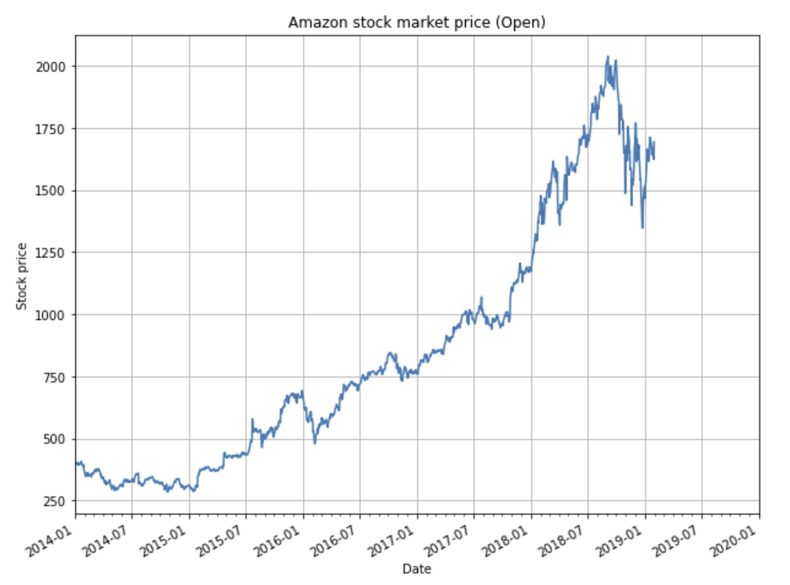
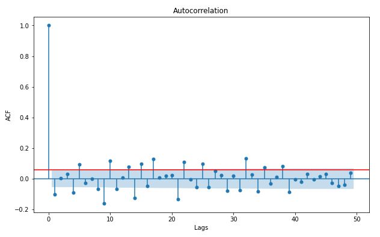
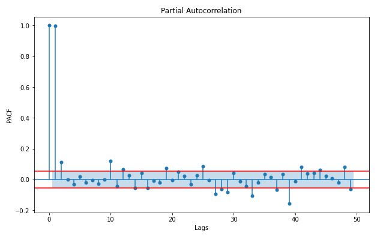

# Stock market price forecasting

**Authors**: Ana Jevtic and Stefanos Baros (both authors contributed equally)

## Dataset

Amazon stock market data can be found at: https://www.kaggle.com/prasoonkottarathil/amazon-stock-price-20142019

Dataset contains 5 years (2/1/14 - 1/31/2019)  of daily prices: `Open`, `High`, `Low`, `Close` and `Adj Close`, as well as `Volume`. In this project we focus on forecasting `Open` prices (depicted below) using time series models.

## Files
1. `stock_market_forecasting.ipynb` - implementation of time series forecasting for stock market data
2. `requirements.txt` - package requirements

## Project description
We use an ARIMA forecasting model to predict:
* day ahead stock market prices
* two days ahead stock market prices

### EDA
We perform exploratory data analysis (EDA) to check for missing data and outliers, as well as identify necessary model order parameters. To identify outliers, we use a statistical measure - Median Absolute Deviation (MAD), on a rolling window of size 60 to account for non-stationarity of the time series:

Next, we analyze the properties of the `Open` signal to find optimal parameters `p` and `q` for the ARIMA(p,d,q) model.

First, we plot the autocorrelation function of the `Open` signal to find best parameter value `q` of the Moving Average (MA) portion of the ARIMA model. Order of the MA model is then selected as the largest lag for which the value of the autocorrelation function is above the critical threshold. The critical threshold is defined as:

where `n` is the number of samples in the signal `Open`.

From the autocorrelation plot, we would conclude that a very high order (~400) MA model is necessary to model the data. However, since the signal is very noisy, we choose a much lower order model (q=2), to prevent overfitting.

Next, we plot the partial autocorrelation function of the `Open` signal to find best parameter value `p` of the Autoregressive (AR) portion of the ARIMA model. Usually, order of the AR model is selected as the largest value of lag for which the value of the partial autocorrelation function is higher than the critical threshold. In our case, we select p=2.

In summary, through the process of EDA, we found no missing data, several outliers that were removed, and concluded that the suitable model of `Open` signal is ARIMA(2,d,2). The typical values used for degree of differencing parameter `d` are 1 or 2, since the signal is non-stationary. We test and showcase the performance of our model for both values of parameter `d`.

### Forecasting methods

We implement and compare the performance of:
* **Day ahead forecasting**: stock market prices for the next day is forecasted using an ARIMA model trained on all available historical values.
* **Two days ahead forecasting**: to predict stock market price at times t+1 and t+2: an ARIMA model is first trained on all values for times [0,t], and price at time t+1 is predicted; then, the predicted value at time t+1 is used to retrain the ARIMA model on values [0,t+1], and price at time t+2 is predicted.

### Results

We use a Holts-Winters Simple Exponential Smoothing model as a benchmark in both day ahead and two days ahead forecasting methods. We used 80% of data for training both Holts-Winters and the ARIMA model, and reserved 20% for testing. Performance of all the implemented models is reported below, where we use sign accuracy and RMSE as comparison metrics.

Model | Sign accuracy | RMSE
----- | --------------| ------
WH (1-day) | 47.05% | 40.57
ARIMA(2,1,2) (1-day) | 55.29% | 40.29
ARIMA (2,2,2) (1-day) | |
WH (2-day) | 50.98% | 53.451
ARIMA(2,1,2) (2-day) | 51.37% | 53.57
ARIMA (2,2,2) (2-day) | |
